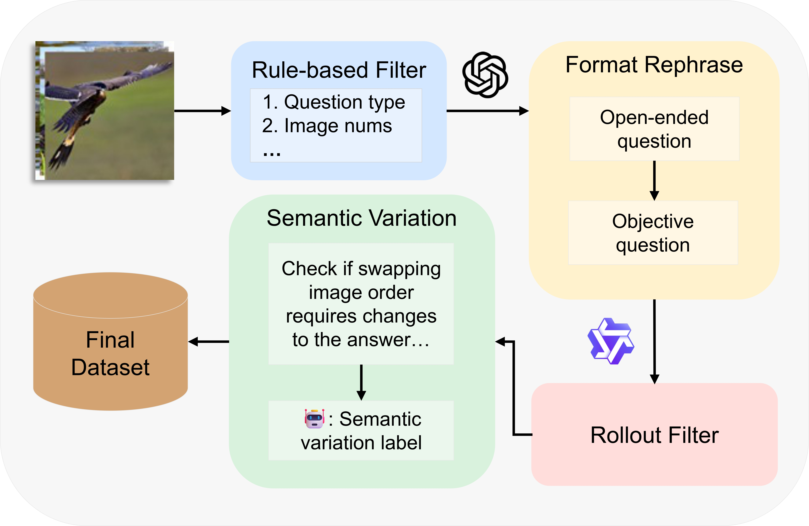
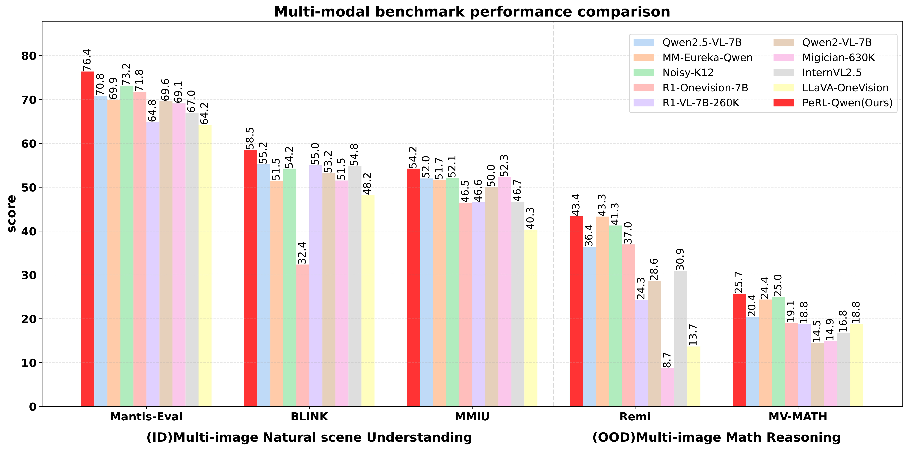
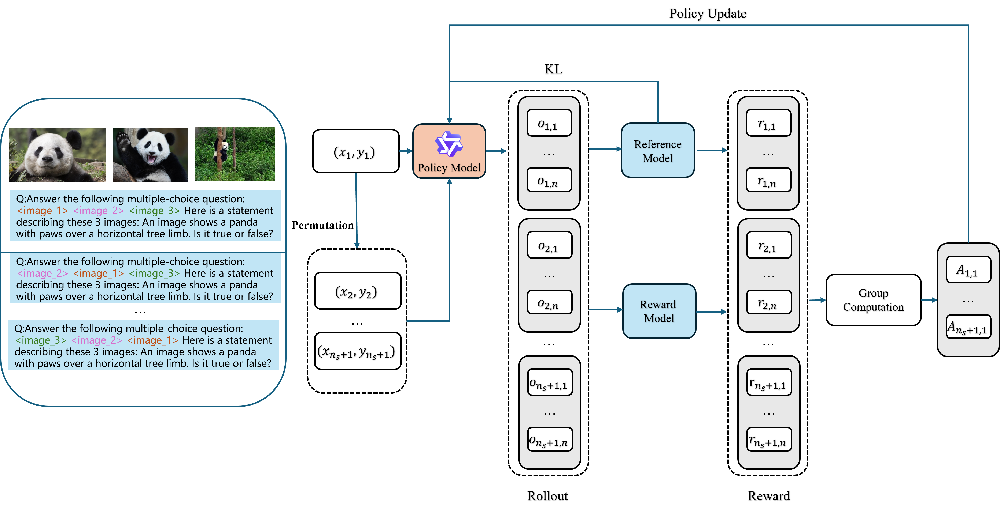

# [PeRL: Permutation-Enhanced Reinforcement Learning](https://arxiv.org/abs/2506.14907)
*Interleaved Vision–Language Reasoning with 7B-parameter Models*

**Authors:** Yizhen Zhang*, Yang Ding*, Shuoshuo Zhang*, Xinchen Zhang, Haoling Li, Zhong-Zhi Li, Peijie Wang, Jie Wu, Lei Ji†, Yelong Shen, Yujiu Yang†, Yeyun Gong

*Equal contribution  †Corresponding authors

**Affiliations:** Tsinghua University, Microsoft, CASIA

**Project Page:** [https://github.com/alchemistyzz/PeRL](https://github.com/alchemistyzz/PeRL)

## 🎯 Overview

Inspired by the impressive reasoning capabilities demonstrated by reinforcement learning approaches like DeepSeek-R1, **PeRL** addresses a critical limitation in current multimodal reinforcement learning: while existing approaches excel at spatial reasoning within single-image contexts, they struggle with **positional reasoning** across multiple images—a capability essential for real-world applications.

**PeRL** introduces a general reinforcement learning framework tailored for interleaved multimodal tasks, featuring a multi-stage strategy that enhances the exploration-exploitation trade-off for improved learning efficiency and task performance.

## 🚀 Key Innovations

### 1. **Permutation-Enhanced Exploration**
- **Image Sequence Permutation**: Systematically shuffles input image orders to simulate varied positional relationships
- **Spatial & Positional Diversity**: Explores both spatial reasoning (within images) and positional reasoning (across images)
- **Order Invariance**: Enforces robust understanding regardless of image presentation order

### 2. **Rollout Filtering for Exploitation**
- **Trajectory Resampling**: Selectively focuses on rollouts that contribute most to learning optimal behaviors
- **Efficient Policy Exploitation**: Filters out low-quality trajectories to maintain training stability


<div align="center">
  
  <p><em>Figure 1: PeRL training pipeline featuring permutation-enhanced exploration and rollout filtering</em></p>
</div>

## 📊 Experimental Results

We evaluate PeRL on **8 comprehensive benchmarks**: 5 multi-image VQA tasks(Natural scene understanding & Math reasoning) and 3 single-image reasoning tasks. Our approach achieves **state-of-the-art performance** on multi-image benchmarks while preserving comparable performance on single-image tasks.

<div align="center">
  
  <p><em>Figure 2: Performance comparison across multi-image and single-image benchmarks</em></p>
</div>

### Performance Summary

| Model | Mantis-Eval | BLINK | MMIU | MathVista | MathVerse | MathVision | Remi | MV-MATH | **Average** |
|-------|-------------|-------|------|-----------|-----------|------------|------|---------|-------------|
| Qwen2.5-VL-7B | 70.80 | 55.23 | 52.00 | 68.20 | 46.30 | 25.07 | 36.38 | 20.41 | 47.90 |
| **PeRL (Ours)** | **76.39** | **58.53** | **54.23** | **73.00** | **49.56** | **28.26** | **43.38** | **25.68** | **51.13** |
| **Improvement** | **+5.59** | **+3.30** | **+2.23** | **+4.80** | **+3.26** | **+3.19** | **+7.00** | **+5.27** | **+3.23** |

**Key Findings:**
- ✅ **Consistent improvements** across all 8 benchmarks
- ✅ **Largest gains** on complex multi-image reasoning tasks (Remi: +7.00, MV-MATH: +5.27)
- ✅ **Preserved performance** on single-image tasks while excelling at multi-image scenarios
- ✅ **3.23 point average improvement** without increasing model parameters

### Training Dynamics

<div align="center">
  
  <p><em>Figure 2.1: Training dynamics showing consistent improvement with permutation-enhanced RL</em></p>
</div>

## 💡 Qualitative Analysis

PeRL demonstrates superior reasoning capabilities in complex multi-image scenarios. In challenging reference-image matching tasks, our approach produces more precise justifications and maintains accuracy even under image reordering.

<div align="center">
  
  <p><em>Figure 3: Qualitative comparison on insect identification task showing improved reasoning under image permutation</em></p>
</div>

## 🔬 Technical Contributions

1. **First general RL framework** for interleaved multimodal reasoning addressing both spatial and positional challenges
2. **Simple but effective permutation strategy** that systematically explores positional relationships in multi-image contexts  
3. **Effective rollout filtering** mechanism that improves exploitation without requiring additional supervision
4. **Comprehensive evaluation** demonstrating consistent improvements across diverse reasoning tasks


## 📝 Citation

```bibtex
@misc{zhang2025perlpermutationenhancedreinforcementlearning,
      title={PeRL: Permutation-Enhanced Reinforcement Learning for Interleaved Vision-Language Reasoning}, 
      author={Yizhen Zhang and Yang Ding and Shuoshuo Zhang and Xinchen Zhang and Haoling Li and Zhong-zhi Li and Peijie Wang and Jie Wu and Lei Ji and Yelong Shen and Yujiu Yang and Yeyun Gong},
      year={2025},
      eprint={2506.14907},
      archivePrefix={arXiv},
      primaryClass={cs.CV},
      url={https://arxiv.org/abs/2506.14907}, 
}
```

---

*This work addresses the critical gap between single-image spatial reasoning and multi-image positional reasoning in multimodal reinforcement learning, paving the way for more robust and generalizable vision-language models.*
